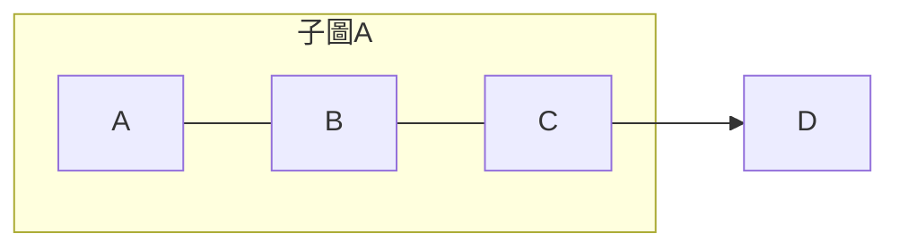
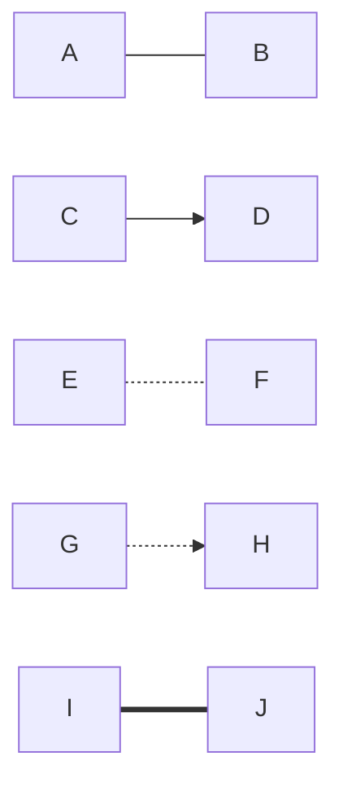
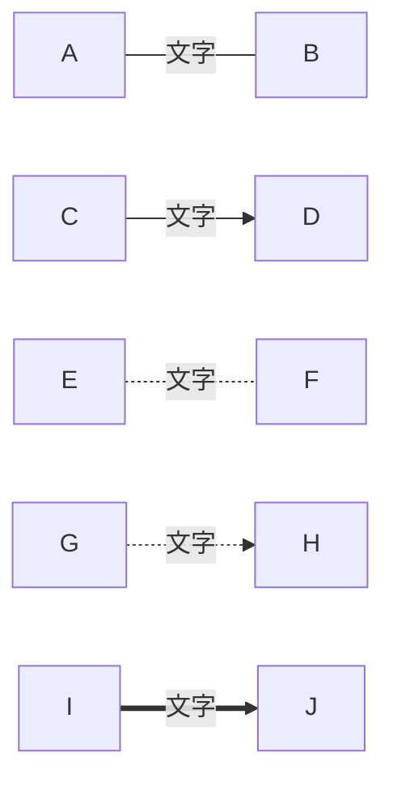
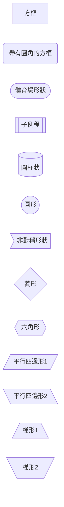
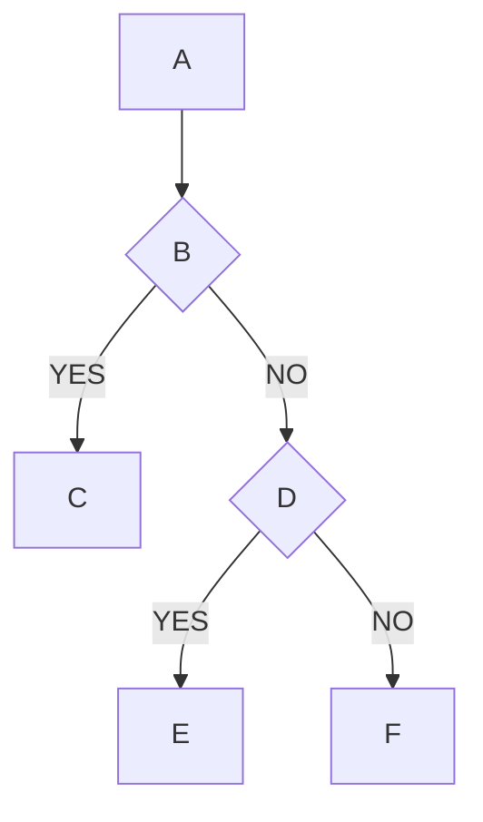
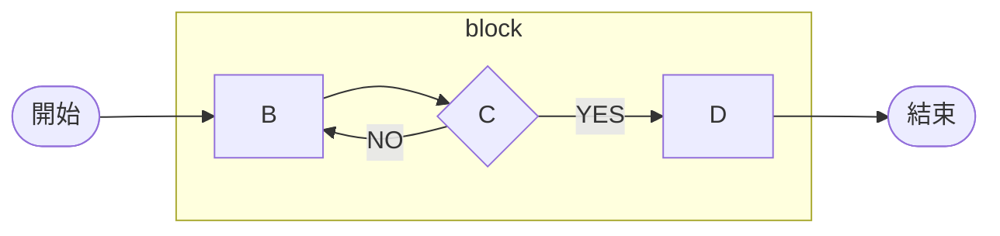

# 系統 SPEC

## 子圖

```mermaid
graph LR
  subgraph 子圖A
      A --- B  --- C
  end
  
  C --> D
```

## 箭頭

```mermaid
graph LR
  A --- B
  C --> D
  E -.- F
  G -.-> H
  I === J
```

### 帶有文字

```mermaid
graph LR
  A-- 文字 ---B
  C-- 文字 --> D
  E -. 文字 .- F
  G -. 文字 .-> H
  I == 文字 ==> J
```

```mermaid
graph LR
  A-- 文字 ---B
  C-- 文字 --> D
  E -. 文字 .- F
  G -. 文字 .-> H
  I == 文字 ==> J
```

### CSS 樣式

```mermaid
graph LR
   id1[方框]-- 文字 ---id2(帶有圓角的方框)

style id1 fill:#f6e6a1,stroke:#a1cdf6,stroke-width:4px
```

## 方向

```mermaid
graph LR
   id1[方框]     
   id2(帶有圓角的方框)
   id3([體育場形狀])
   id4[[子例程]]
   id5[(圓柱狀)]
   id6((圓形))
   id7>非對稱形狀]
   id8{菱形}
   id9{{六角形}}
   id10[/平行四邊形1/]
   id11[\平行四邊形2\]
   id12[/梯形1\]
   id13[\梯形2/]
```

一對相對側具有半圓形的矩形構成的二維幾何形狀

### 範例

```mermaid
graph TD
   id1[A] --> id2{B}
   id2{B} -- YES --> id3[C]
   id2{B} -- NO --> id4{D}
   id4{D} -- YES --> id5[E]
   id4{D} -- NO --> id6[F]
```

```mermaid
graph LR
   id1([開始]) --> id2[B] --> id3{C}
   subgraph block
      id3{C} -- NO --> id2[B]
      id3{C} -- YES --> id4[D]
   end
   id4[D] --> id5([結束])
```